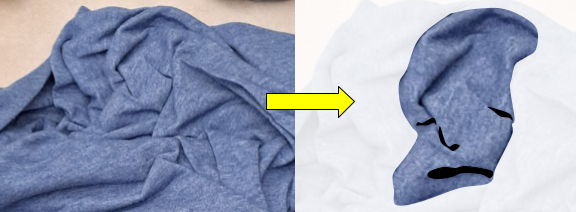

# serendimage

*An unexpected likeness discovered in a surprising place.*

People who like to watch clouds will often say, "That one looks like a sheep!" They are finding seredimages. Here is a serendimage of a sleeping face, wearing a pajama cap, in some laundry.

