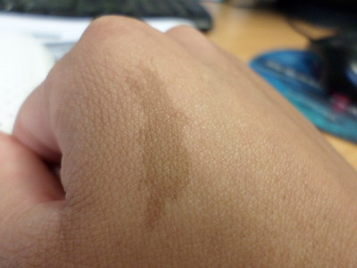

# somidion

/so'mɪdiən/

noun &mdash; *A mark on or feature of a person's body that has a specific location, is persistent rather than ephemeral, is characteristic rather than incidental, is highly unique, and can be recognized with ordinary human senses based on a simple description.*

From GR *soma* 'body' + GR *idio* 'personal, unique'.

The typical person knows dozens of unique things about their own body &mdash; a freckle just next to their right eyelid, a damaged molar repaired with a metal crown, a tattoo of a butterfly behind their left elbow, a scar on their knee, a patch where hair is discolored. Each of these is a *somidion*.

<figure>
   
   <figcaption>A birthmark can be a somidion. Image credit: <a href="https://www.flickr.com/photos/nickipicki/8877057955/" target="flickr">Nicole Southgate, Flickr</a></figcaption>
</figure>

Somidions may obvious to an external observer, or hidden. They may be present at birth, develop over time, or result from an accident.

 A biometric like a fingerprint, retinal pattern, genome, facial geometry, or voice print is not a somidion because it is only recognizable with specialized measurement and/or computation.

 A hairstyle, beard, or moustache is not a somidion, because it can be easily changed, and many people can have have very similar ones, either by accident or on purpose.

 